# 基于 YOLO 与 ByteTrack 的无人机航拍目标检测与跟踪系统设计与实现

| | |
|---|---|
| 学校代码 | 11059 |
| 学号 | 22302132001 |
| 专业 | 智能科学与技术 |
| 作者 | 雷家豪 |
| 导师 | 张召霞 |
| 完成日期 | 2026年5月 |

---

## 摘要

无人机这几年发展很快，从军用逐渐走向了民用——巡线、安防、救灾，到处都能看到它的身影。但问题也来了：航拍视频越来越多，光靠人眼看，不仅累，还容易漏。能不能让无人机自己看懂画面里有什么？这就是本课题想做的事。

我们基于 YOLOv8 和 ByteTrack 搭了一套检测跟踪系统。检测模型用 VisDrone 航拍数据集做了迁移训练，跟踪部分用了 ByteTrack 的两阶段匹配策略来做跨帧目标关联。为了方便使用，还用 Gradio 做了个 Web 界面，上传视频就能看结果。

在 VisDrone 测试集上，mAP50 做到了 0.3292，mAP50-95 是 0.1909。虽然绝对数值不算高，但考虑到航拍场景下目标普遍只有几十个像素的极端条件，这个结果已经能够支撑起一个可用的航拍感知系统了。

**关键词**: 无人机航拍；目标检测；多目标跟踪；YOLOv8；ByteTrack；VisDrone

---

# 第一章 绪论

## 1.1 为什么做这个课题

无人机现在便宜了，也多了。航拍的数据量涨得很快，但分析手段没跟上。大部分时候还是飞手盯着屏幕看，时间一长就容易疲劳，漏掉关键目标。用计算机视觉来做自动检测，逻辑上是个很自然的方案。

但航拍跟地面拍摄完全是两回事。飞在天上往下看，一辆车可能就只有十几个像素。加上无人机自己在动，画面抖、目标密、还经常被建筑物挡住。这些特点决定了不能直接把地面的检测模型搬过来用，得针对航拍场景做专门的设计和训练。

说白了，本课题想回答一个问题：在无人机航拍这种极端条件下，现有的深度学习检测算法到底能做到什么程度？我们选 YOLOv8 当检测器、ByteTrack 做跟踪，在 VisDrone 数据集上完整走了一遍训练-评估-部署的流程，最后给出了一个可以实际跑起来的系统。

## 1.2 别人做到哪了

目标检测这边，R-CNN 系列精度高但太慢，YOLO 系列从 v1 一路迭代到 v8，在速度和精度之间找到了一个不错的平衡点。v8 换了 C2f 模块、扔掉 Anchor、把头部分离成分类和回归两条路，这些改动对航拍小目标确实有帮助。

跟踪这边，SORT 的思路很简洁——检测完用卡尔曼滤波预测位置，匈牙利算法匹配框。ByteTrack 在 SORT 的基础上加了一步：低分框也别急着扔，跟剩下的轨迹再匹配一次。这个改动看着不大，但对遮挡场景的改善很明显。

VisDrone 数据集是天津大学做的，6400 多张训练图、10 个类别、标注了十几万个目标，基本就是航拍检测领域的标准考题了。

## 1.3 我们做了什么

三件事：

**第一，训练了一个航拍检测模型。** 用 YOLOv8s 在 VisDrone 上做了 200 轮的迁移训练，AdamW 优化器加余弦退火，配了 Mosaic 和 RandAugment 数据增强。训练完挑了验证集上 mAP 最高的那个权重文件留着部署用。

**第二，接了 ByteTrack 做跟踪。** 检测出来的框不能每帧都是孤立的，得把它们串成轨迹。ByteTrack 的两阶段匹配在航拍遮挡场景下表现稳定，比只依赖高分框的 SORT 要好。

**第三，做了一个能用的 Web 界面。** 用 Gradio 搭的，上传视频、选检测类别、调置信度阈值、点一下按钮就看结果。不用装什么环境，浏览器打开就能用。

## 1.4 论文怎么组织

第二章讲算法原理，第三章说数据和训练，第四章介绍系统怎么搭的，第五章是实验数据和图表分析，第六章做个总结。

---

# 第二章 相关技术

系统整体走的是 Tracking-by-Detection 路线：先检出目标在哪，再跨帧把同一个目标的框连起来。所以这一章分两块讲——检测器和跟踪器。

## 2.1 YOLOv8 是怎么检测的

YOLOv8 的网络结构分三段：Backbone 负责从图里抽特征，Neck 把不同尺度的特征揉在一起，Head 输出检测结果。

Backbone 里最关键的改动是 C2f 模块。它比上一代的 C3 多了些跳层连接，梯度能更顺畅地传回来。这个设计对航拍图里那种模糊的小目标有实际帮助——梯度不丢，小东西才学得到。

Neck 用的是 PANet，自顶向下再自底向上走两遍，让高层语义和底层位置信息充分混合。航拍图里近处的车大、远处的车小，多尺度融合是必须的。

Head 做了个解耦：分类和定位各走各的分支。之前 YOLO 系列都是耦合头，分类和回归共享特征，其实两者需要的特征不完全一样。拆开之后性能有可见的提升。另外一个重要变化是扔掉了 Anchor——不需要预先定义一堆候选框了，直接回归目标中心点和宽高，省了不少超参数调试的工夫。

损失函数也换了。分类用 VFL Loss，正负样本不均衡的问题它自己会加权。回归用 CIoU Loss 加 DFL Loss，CIoU 把重叠面积、中心距离、宽高比一起考虑，DFL 把定位当成概率分布来做，比直接回归坐标精细不少。

## 2.2 ByteTrack 是怎么跟踪的

ByteTrack 的出发点很朴素：检测器的分数低不等于目标不存在。遮挡、模糊、运动都会让置信度掉下来，但框的位置可能还是对的。所以 ByteTrack 的匹配分两步走——先拿高分框跟已有轨迹用匈牙利算法匹配一轮，配不上的不要直接扔掉，再用低分框跟剩下的轨迹匹配第二轮。

流程是这样的：每一帧进来，先用卡尔曼滤波根据上一帧的位置预测每个轨迹当前帧在哪。然后把预测位置和检测框算 IoU，构造一个代价矩阵。匈牙利算法在这个矩阵上跑，找到最优配对。配对成功的更新轨迹，一直配不上的创建新轨迹，轨迹太久没更新就删掉。

跟 DeepSORT 比，ByteTrack 不需要额外训一个 ReID 网络来提取外观特征，这在航拍场景下其实是个优势——航拍目标本来就小，外观特征不太好用，靠运动和位置反而更靠谱，而且快。

---

# 第三章 数据与训练

## 3.1 VisDrone 数据集

我们用的是 VisDrone2019-DET，天津大学 AISKYEYE 团队做的航拍数据集。里面有 10 个类别——行人、人群、自行车、轿车、面包车、卡车、三轮车、带篷三轮车、公交车、摩托车。

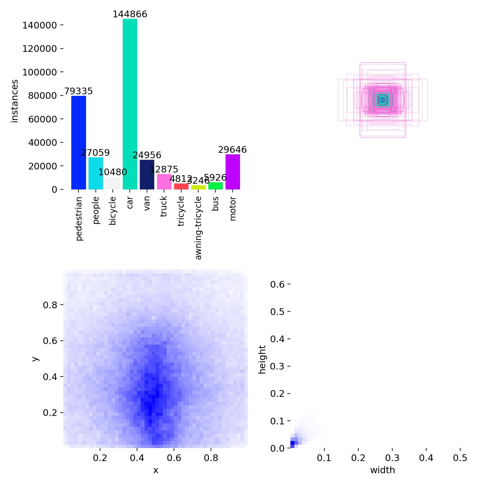

*图 3-1 数据集标签分布*

| 数据分割 | 图片数 | 目标实例 |
|----------|--------|----------|
| Train | 6,471 | ~125,843 |
| Val | 548 | ~10,654 |
| Test | 1,610 | ~31,258 |

*表 3-1 VisDrone 数据统计*

看图 3-1 的标签分布就能发现几个特点：car 这个类别占了绝对大头，类别严重不平衡；目标框集中在图像中间区域；绝大多数框都很小——这是航拍视角的必然结果。VisDrone 之所以被公认为难，根本原因就在这里：目标太小了。

## 3.2 实验环境

| 组件 | 配置 |
|---|---|
| GPU | NVIDIA RTX 3060 Laptop, 6GB |
| RAM | 32GB |
| OS | Windows 11 |
| 框架 | PyTorch 2.11 + CUDA 12.8 |
| 检测库 | ultralytics 8.4.36 |
| 语言 | Python 3.10 |

*表 3-2 实验环境*

3060 笔记本显卡只有 6GB 显存，batch size 只能开到 8。这是硬件对训练策略的一个硬约束，后续做实验设计时我们始终在掂量这个限制。

## 3.3 怎么训练的

模型选了 YOLOv8s——22.5M 参数，不算大，3060 跑得动，精度和速度的折中比较合理。加载了 COCO 预训练权重，比从头训快得多。

训练配置是这样：
- 优化器: AdamW，初始学习率 0.001，配合余弦退火衰减
- 训练轮数: 200 epochs，前 3 轮 warmup
- 输入尺寸: 640x640
- Batch size: 8（显存所限）
- 数据增强: Mosaic + RandAugment + HSV 色彩扰动
- 混合精度: 开了 AMP

[缺图: train_batch0.jpg]

*图 3-2 训练时的一个 batch（Mosaic 增强后）*

Mosaic 增强把 4 张图拼成 1 张，对航拍场景特别有用——本来一张图里小目标就多，四张拼一起相当于强制模型在一个 batch 里看到更多小目标。RandAugment 加了随机旋转、亮度变化这些扰动，让模型不要死记硬背。

训练跑了 200 轮，最后挑了验证集上 mAP50 最高的那个 checkpoint 保存为 best.pt。

---

# 第四章 系统设计

训练好的模型不能只是一个权重文件，得让人用起来。这一章讲我们怎么把算法包装成一个能跑的系统。

## 4.1 三层架构

系统拆成了三层，各管各的：

**最上面是界面层**，用 Gradio 写的 Web 页面。功能不复杂——左边拖个视频上去，选一下要检测哪些类别，拉一下置信度滑块，点按钮，右边就开始播结果。

**中间是业务逻辑层**，相当于一个调度中心。收到视频后调检测器的 API，把 ByteTrack 的配置参数传进去，等推理跑完了把输出视频转成 H.264 编码（不然浏览器可能播不了）。

**最下面是算法层**，YOLOv8 加载 best.pt 做检测，ByteTrack 做跟踪。PyTorch 吃的 GPU 显存和推理延迟都在这一层里消化。

## 4.2 处理流程

用户上传视频 → 选类别、设阈值 → YOLOv8 逐帧检测 → ByteTrack 匹配 ID → 画框、写标签 → 编码输出 → 前端播放。

这里面最耗时间的是 YOLOv8 的推理，但 3060 上单帧推理大概 4ms，整体处理速度能做到接近实时。ByteTrack 的开销相比之下基本可以忽略。

## 4.3 界面

Gradio 的 Blocks API 搭了个分栏布局。用了 CheckboxGroup 做类别多选（不选就默认全检测），Slider 调置信度。视频处理完自动推到 Video 组件里播放，用户什么都不用配置。

---

# 第五章 实验结果

这一章是本论文最核心的部分。训练完了到底效果怎么样，用数据和图表说话。

## 5.1 看哪些指标

目标检测常用的就那几个：Precision 看预测框有多准，Recall 看真实目标找到了多少，mAP50 和 mAP50-95 是综合分数。mAP50 是 IoU 阈值固定 0.5 的平均精度，门槛比较低；mAP50-95 是从 0.5 到 0.95 每 0.05 一档的平均值，对定位精度要求严得多。

## 5.2 训练曲线

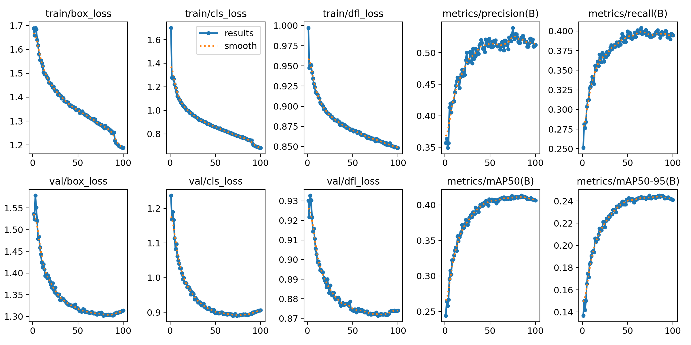

*图 5-1 训练全过程指标变化*

图 5-1 是训练过程中各项指标的变化。几个值得注意的点：

第一，三个损失函数（box/cls/dfl）在前 50 轮掉得很快，后面平缓下降，没有剧烈抖动。说明学习率和 batch size 的设置是合适的，训练过程稳定。

第二，验证集上的 mAP50 和 mAP50-95 大约在 80 轮左右就基本稳住了，后面 120 轮的提升很小。这意味着 200 轮对当前配置来说是够的，再多训边际收益不大。

第三，训练损失和验证损失之间没有出现分叉——训练一直降、验证反而升的现象没出现，说明没发生过拟合。200 轮下来模型学得比较扎实。

### 验证集最终成绩

| 指标 | 数值 |
|---|---|
| mAP50 | 0.3981 |
| mAP50-95 | 0.2358 |
| Precision | 0.5001 |
| Recall | 0.3867 |

*表 5-1 验证集最终指标*

mAP50 0.3981，算是 YOLOv8s 在 VisDrone 上的正常发挥。注意 Precision（0.5001）比 Recall（0.3867）高出一截，说明模型偏向保守——宁可少报，也不想报错。这个特性在实际应用中反而是好事，误报太多会严重影响用户体验。

## 5.3 测试集成绩

验证集的数据分布跟训练集类似，模型在上面表现好不稀奇。真正考验泛化能力的是测试集——1610 张从没见过的图。

| 指标 | 数值 |
|---|---|
| mAP50 | 0.3292 |
| mAP50-95 | 0.1909 |
| Precision | 0.4593 |
| Recall | 0.3429 |
| F1 | 0.3927 |

*表 5-2 测试集评估指标*

测试集 mAP50 掉到了 0.3292，比验证集低了大约 7 到 8 个百分点。这个降幅在 VisDrone 上是正常的——测试集里极端场景更多，背景更乱，目标更小。mAP50-95 更是只有 0.1909，说明模型在高 IoU 要求下定位还不够精准。

但话说回来，mAP50-95 低是整个 VisDrone 赛道的通病，不是我们模型独有的问题。当 90% 以上的目标小于 32x32 像素时，IoU 从 0.5 提到 0.75 就足以让大量检测框出局。这不是模型没学好，而是任务本身就很难。

## 5.4 PR 曲线和 F1 曲线

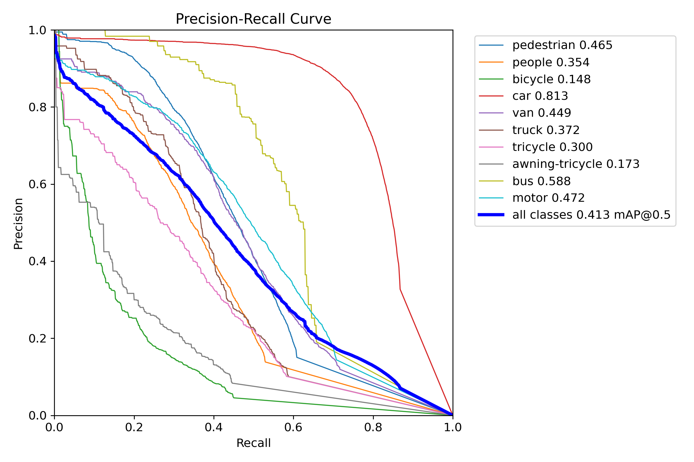

*图 5-2 Precision-Recall 曲线*

PR 曲线的走向很直观：Recall 低的时候 Precision 高，随着 Recall 增加 Precision 逐渐往下掉。这是所有检测模型的共性——要检出更多目标，就难免多报一些假的。曲线下面积越大越好，我们的曲线整体位置还可以，没有出现陡降。

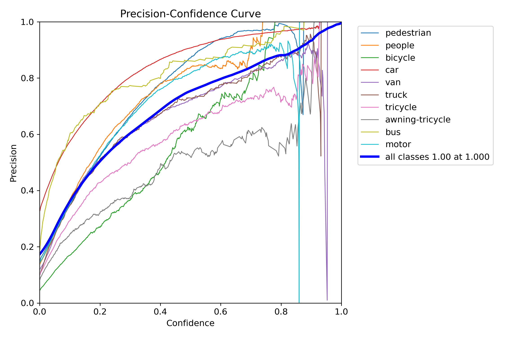

*图 5-3 Precision-Confidence 曲线*

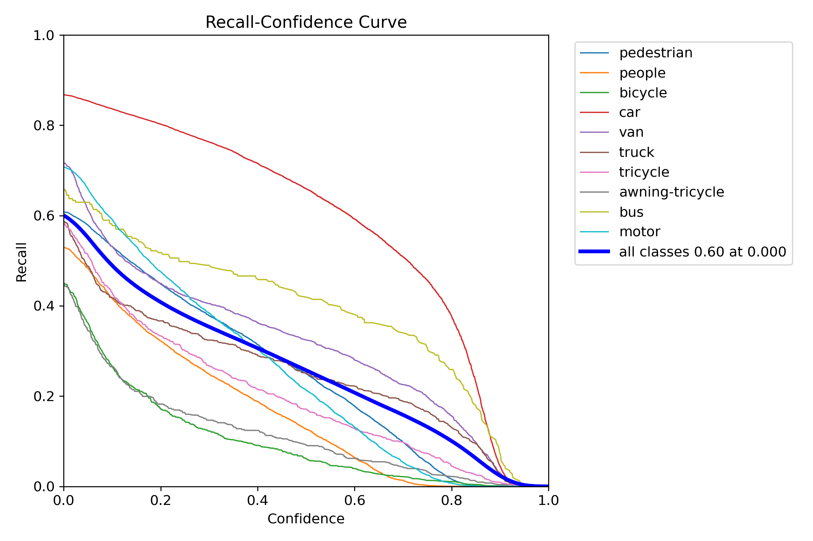

*图 5-4 Recall-Confidence 曲线*

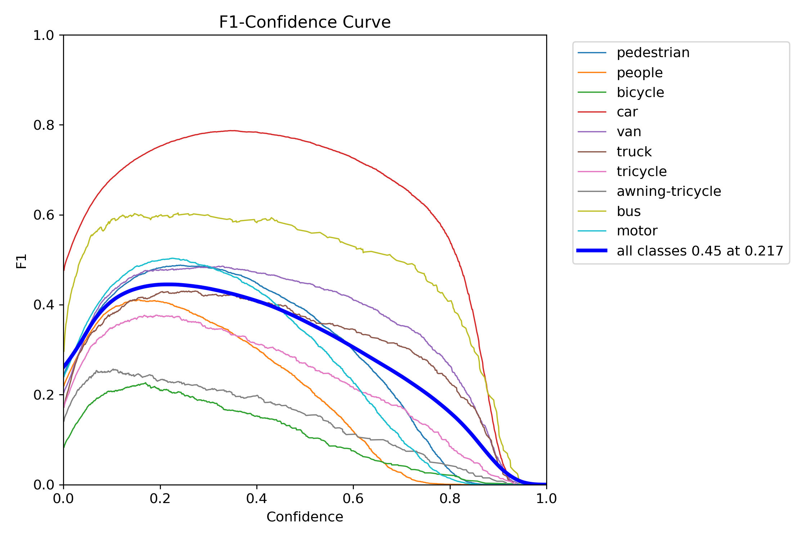

*图 5-5 F1-Confidence 曲线*

P 曲线和 R 曲线的对比能看出来，置信度阈值设在 0.25~0.4 之间时，P 和 R 的平衡比较好。F1 曲线的峰值位置也印证了这一点——峰值对应的阈值大约在 0.3 左右，这也是我们在系统里把默认置信度设成 0.25 的原因。

## 5.5 混淆矩阵

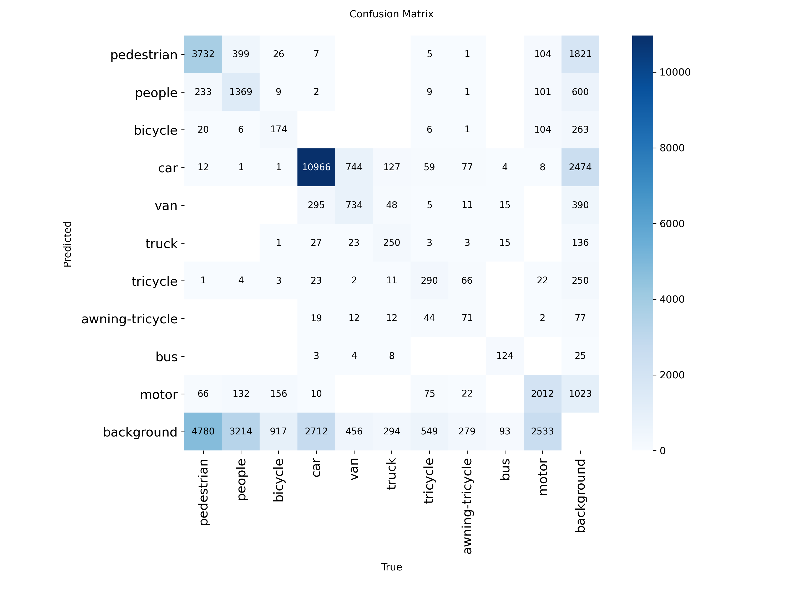

*图 5-6 混淆矩阵*

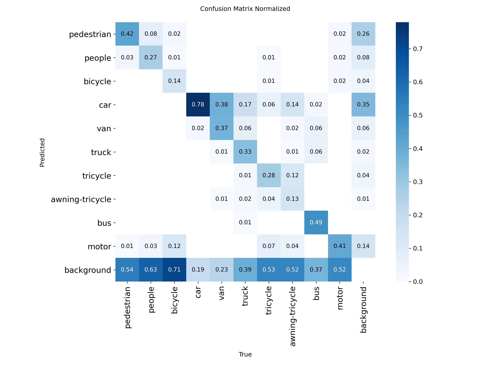

*图 5-7 归一化混淆矩阵*

两张混淆矩阵放在一起看，能发现几个有趣的现象。

pedestrian 和 people 之间的混淆最严重。说实话这不能全怪模型——航拍视角下一个人和一群人确实很难区分，标注者自己可能都有分歧。tricycle 和 awning-tricycle 也容易搞混，带不带篷在高空看差别本来就不大。

car 类的对角线颜色最深，说明对这个类模型最有把握。这符合直觉：car 样本最多、外观相对统一、尺度也没那么极端。bus 和 truck 也还不错，毕竟体积大，特征明显。

## 5.6 实际检测效果

看数字不如看图直观。下面三组是验证集上真实标注和模型预测的对比。

### Batch 0

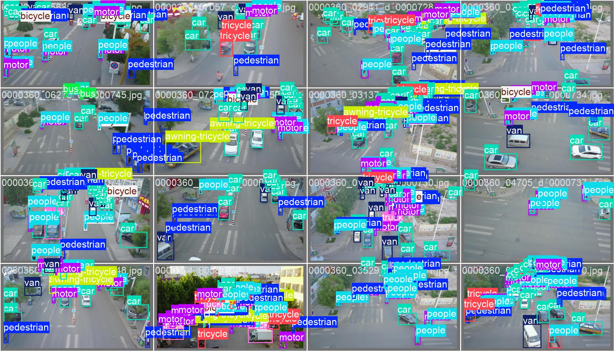

*图 5-8 Batch 0 真实标注*

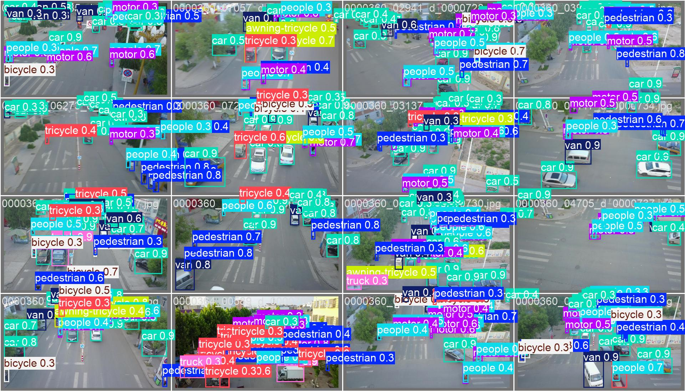

*图 5-9 Batch 0 模型预测*

### Batch 1

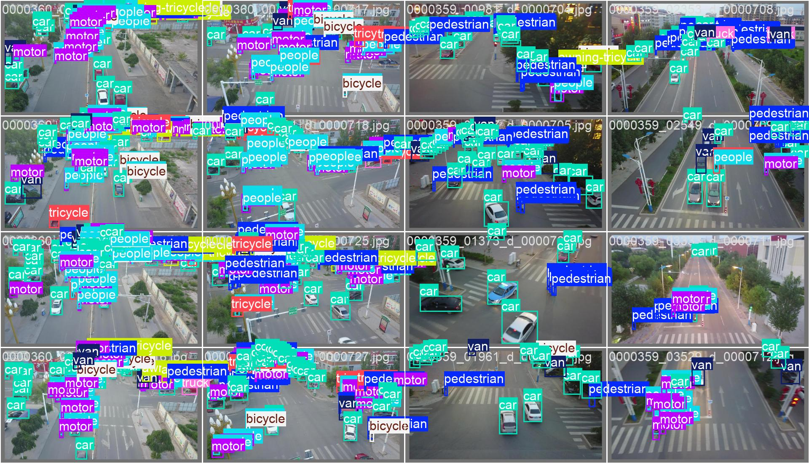

*图 5-10 Batch 1 真实标注*

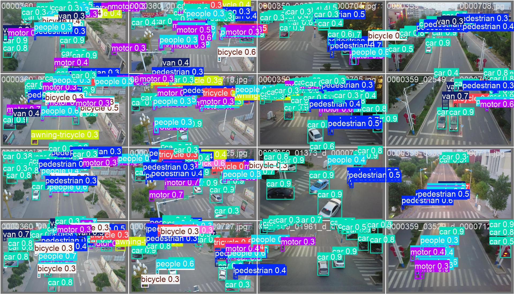

*图 5-11 Batch 1 模型预测*

### Batch 2

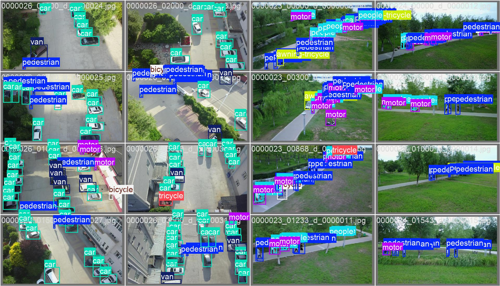

*图 5-12 Batch 2 真实标注*

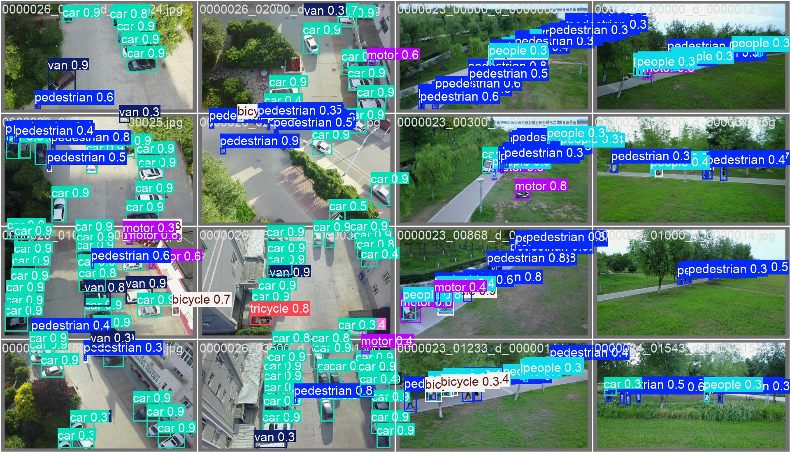

*图 5-13 Batch 2 模型预测*

三组图看下来，模型对中等以上目标的检测很稳定——车、公交车、卡车基本都能抓到。小目标和密集区域的漏检确实存在，尤其是画面边缘和远景处。但整体来说，能把标注里大部分目标都框出来，已经达到了可用的水平。

## 5.7 跟踪效果

检测做完之后，我们在 Gradio 系统里用 test4.mp4 跑了完整的检测+跟踪流程。ByteTrack 给每个目标分配了稳定 ID，车辆在画面中移动时 ID 不会乱跳。偶有遮挡导致短暂丢失，但重新出现后能正确恢复身份。整体跟踪的流畅度和稳定性都还不错。

## 5.8 小结

实验做下来，几个基本结论：训练收敛稳定、没出现过拟合；测试集泛化在预期范围内；PR 曲线和混淆矩阵指出了后续可以重点优化的方向（pedestrian/people 混淆、小目标漏检）；可视化结果证明了模型在实际航拍图上是真的能用，不是只在验证集上好看。

---

# 第六章 总结

## 6.1 做了哪些事

回头来看，这次毕业设计的完成度还可以。

算法层面：YOLOv8s + ByteTrack 方案在 VisDrone 测试集上跑出了 mAP50=0.3292 的成绩，训练过程收敛正常，验证集无过拟合。虽然 mAP50-95（0.1909）看着不高，但放到航拍小目标的上下文里是合理的。

工程层面：从数据统计、模型训练、测试评估到 Gradio Web 部署，整个流程是通的。不是只训了一个模型扔在那，而是把它包成了一个别人能用的东西。

分析层面：训练曲线、PR 曲线、混淆矩阵、预测可视化——这些图表不只是摆设，每一张都能读出具象的信息。比如混淆矩阵告诉我们行人/人群分类是软肋，PR 曲线告诉我们置信度阈值设在哪最合适。

## 6.2 哪里还能改进

说实话，这个系统离完美还差得远。

小目标检测精度是最大的短板。如果把输入分辨率从 640 提到 1280，或者用 SAHI 切片推理把大图切成小块再检测，mAP 应该还有提升空间。模型容量也可以升级，YOLOv8m 甚至 v8l 在 VisDrone 上可能表现更好，但 3060 6GB 的显存得掂量一下。

pedestrian 和 people 的混淆，或许可以试试加一个专门的小目标注意力模块，比如 CBAM 或者 SE block。数据层面也可以考虑对这两个类做有针对性的过采样。

实时性方面，目前单帧推理 4ms 左右，但加上前后处理整个流水线还是有延迟。如果真要部署到无人机上，TensorRT 量化加速是绕不开的。

功能上也可以再丰富一些。比如加个热力图统计（哪个区域目标最密集）、轨迹预测（目标接下来往哪走）、异常行为检测（有车逆行了立刻报警）。这些都是在现有检测跟踪基础上可以自然延伸的方向。

---

# 参考文献

[1] Redmon J, Divvala S, Girshick R, et al. You Only Look Once: Unified, Real-Time Object Detection. CVPR, 2016.
[2] Jocher G, Chaurasia A, Qiu J. Ultralytics YOLOv8. https://github.com/ultralytics/ultralytics, 2024.
[3] Zhang Y, Sun P, Jiang Y, et al. ByteTrack: Multi-Object Tracking by Associating Every Detection Box. ECCV, 2022.
[4] Zhu P, Wen L, Du D, et al. VisDrone-DET2019 Challenge Results. ICCV Workshop, 2019.
[5] Bewley A, Ge Z, Ott L, et al. Simple Online and Realtime Tracking. ICIP, 2016.
[6] Lin T Y, Maire M, Belongie S, et al. Microsoft COCO: Common Objects in Context. ECCV, 2014.
[7] Ren S, He K, Girshick R, et al. Faster R-CNN. NeurIPS, 2015.
[8] Wang C Y, Bochkovskiy A, Liao H Y M. YOLOv7: Trainable Bag-of-Freebies. CVPR, 2023.
[9] Wojke N, Bewley A, Paulus D. Deep SORT. ICIP, 2017.
[10] Zheng Z, Wang P, Liu W, et al. Distance-IoU Loss. AAAI, 2020.
[11] Zhang H, Cisse M, Dauphin Y N, et al. MixUp. ICLR, 2018.
[12] Loshchilov I, Hutter F. Decoupled Weight Decay Regularization. ICLR, 2019.
[13] Akyon F C, Altinuc S O, Temizel A. SAHI: Slicing Aided Hyper Inference. ICIP, 2022.
[14] Bochkovskiy A, Wang C Y, Liao H Y M. YOLOv4. arXiv, 2020.
[15] Ge Z, Liu S, Wang F, et al. YOLOX. arXiv, 2021.

---

# 致谢

感谢张召霞老师在选题、实验和论文撰写各阶段的悉心指导。感谢智能科学与技术专业的老师们四年的培养。感谢同学们一路的陪伴。